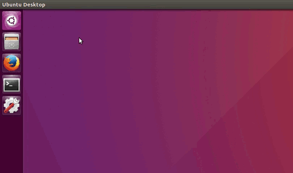

# Raspberry Smart Mirror

## Biography  
**Authors:**
Jordi Jaspers [[Github](https://github.com/Jordi-Jaspers "Github Page"), [Linkedin](https://www.linkedin.com/in/jordi-jaspers/ "Linkedin Page")] 
Simon Aerts [[Github](https://github.com/Jordi-Jaspers "Github Page"), [Linkedin](https://www.linkedin.com/in/jordi-jaspers/ "Linkedin Page")]
  
**Date of initial commit:** 
17/12/2019

**Description:**
This is an Embedded Systems & Networks Project For a course at the UHasselt/KULeuven University. The objective is to create a DIY smart mirror with an IoT implentation. Powered by a Rasberry pi so we could communicate with the internet. This allows us to display certain information like news, agenda, weather, etc.

Networks part of the course is that we implemented physical buttons that are interchangeable with capacitive buttons to control smart object inside your house or connected to the network.

The mirror makes use of [Rasbian](https://www.raspberrypi.org/downloads/raspbian/ "Rasbian Page") and [Magicmirror](https://github.com/MichMich/MagicMirror "MagicMirror page") software.

**For a full-presentation about this project, open "Assets/Presentation.pptx"**
  
### What We Learned

* Creating an Embedded System with Rasberry Pi
* Using an ESP32 for Communication between devices
* Creating and working with servers
* Basics of terminal commands & Node.js
* Building electronic circuits to power the screen via a controller and Rasberry
* Principles of a 2-Way mirror
* Extra functionality of python scripts
* Carpentry of building a mirror-frame

### TODO-List
**Hardware (Jordi Jaspers)**
- Create a Repository --> done!
- Build a frame --> done!
- Look up information about monitors and controllers --> done!
- Tutorials about Raspberry VS monitors --> done!
- Design and create the electric circuit of the mirror --> done!
- Assemble the frame and the Circuit --> done!
- Create buttons for extra functionality (Networks & RF) --> Can still use some improvements! 

**Software (Simon Aerts)**
- Install Rasbian on the Pi --> done!
- Find and install the right dependencies --> done!
- Look up information about Smart mirror software --> done!
- install smart mirror software and program some extra modules --> done!
- Create a server to communicate with the Pi on a distance --> done!
- Connect Server to ESP32 --> done!
- Be able to push commands from Pi to ESP via server --> done!
- Find a way to let the ESP change output after communicating with the Pi --> done!

**Full Assembly**
- Assemble software side with the Hardware side - done!
- Setup the full mirror - done!

### Improvements
* Capacitive buttons through the mirror?
* Brighter Screen?

### Build Instructions: Hardware
**Requirements**
* 15' laptop monitor
* Display controller with the same modelnumber as the monitor
* Acrylic 2-way mirror OR a window with mirror foil
* 4 wooden beams
* 2 wooden plates with the same dimensions as the mirror
* Black cloth or sticker
* Nails
* 2-sided tape
* Raspberry pi
* Buttons - switches (Capacitive or Physical)
* LED's
* Wires
* HDMI-cable

#### The mirror-frame

**Step 1: Prep the Timber**  

| Preping the Timber | 
|:-----------------------------:|
|  |

 Using 80grit paper I ran each length over the belt until I was left with a flat surface. Once I was finished sanding them, I used an old paint scraper as a cheapo cabinet scraper. It worked wonderfully, you just make short, repetitive scraping motions towards you, and watch the grain completely flatten out and become almost glass smooth.

**Step 2: Make the Cuts**  

| Cutting the Timber | 
|:-----------------------------:|
|  |

There are two crucial parts here:

The 2 long & short sides must be exactly the same length. Exactly the same. Or your frame will not be square no matter what you do.

Keep track of what side of the jig you make your cuts on. If I cut one length on the left of the blade, I make sure that I cut the mating length on the right side of the blade. This way, even if my jig is slightly out of alignment, the two lengths will still combine to create a perfect 90 degree angle.

Once they were cut, I ran them through the table saw and cut out a rebate on all 4 pieces for the MDF backing board and plexiglass to sit in.

**Step 4: Create 2 Backplates**  

| Backplate with Flash | Backplate without Flash |
|:-----------------------------:|:---------------------:|
|  |  |

The backplate is naturally a MDF-plate with the same dimensions of the mirror. In one of the backplates you have to create hole wich would fit the 15' monitor. Also put a black sticker on this backplate to prevent light being absorbed when we put it against the mirror.

**Step 5: Glue Up & Nail down**  

| Final Assembly | 
|:-----------------------------:|
|  |

**Step 6: Bore a hole into the frame to lead the Power supply cable**

#### The electrical circuit

- Step 1: Sketch the circuit
- Step 2: Connect the monitor to the controller
- Step 4: Connect the controller with a HDMI to Raspberry
- Step 5: Look up the pin configuration of the Pi
- Step 6: Connect the 5v voltage supply from the Pi to the controller
- Step 7: Create breadbord circuit with connectiont to Pi inputs
- Step 8: Connect the Power Supply to the Pi
- Step 9: Put the full circuit in the frame and stick it down with double-sided tape  

| Final Circuit Assembly (Nog foto invoegen)| 
|:-----------------------------:|
|  |

#### Final product  

| Monitor ON | Monitor OFF |
|:-----------------------------:|:---------------------:|
|  |  |

### Installation Instructions: Software

#### Code
Install [Rasbian](https://www.raspberrypi.org/downloads/raspbian/ "Rasbian Page") on your Rasberry pi by going to their site and following the instructions. Once installed, connect a keyboard and mouse to your Rasberry and boot up Rasbian.

Connect to the internet via Ethernet or WIFI-2.4GHz and open your terminal.

| Connecting to the WIFI | Opening Terminal |
|:-----------------------------:|:---------------------:|
|  |  |

If you have [git](https://git-scm.com/book/en/v2/Getting-Started-Installing-Git "Git Page") installed, clone [this](https://github.com/Jordi-Jaspers/Raspberry_Smart_Mirror "Our repository") repository.

```
git clone git@github.com:Jordi-Jaspers/Raspberry_Smart_Mirror
```

**Alternatively, you can download a zip file containing the project (green button on the repository page)**

Navigate to the folder for the repository and go into the "code" folder.

```
cd Smart-Mirror
cd code
```

#### Install your dependencies

**Installing Node.js (Skip this part if you have already)**
make sure you have [Node.js](https://nodejs.org/en/download/ "Node.js page") installed before doing this. Go to node.js download page and check right click on the version of ARM that you need and choose Copy Link address.

After that in the terminal using wget download the tar.gz file for that version. Just type wget, paste the link copied before and make sure the extension is .tar.gz. If it's something else change it to this and it should be ok. For example I will need ARMv6 and I will type this in my terminal:

```
wget https://nodejs.org/dist/v8.9.0/node-v8.9.0-linux-armv6l.tar.gz
```

Using tar that is already installed with the system on your raspberry pi just type this (make sure you change the filename with the file that you have)

```
tar -xzf node-v8.9.0-linux-armv6l.tar.gz
```

Copy the files to usr/local directory with the following code.

```
cd node-v6.11.1-linux-armv6l/
sudo cp -R * /usr/local/
```

Check if node and npm are installed correctly. This lines should print the version of node and npm installed.

```
npm -v
```

Installing the actual dependencies is done with

```
npm install /dependencies
```

#### Extra software???
nog extra installaties moeten hier.....

### Running the smart-mirror application

To run the application run the following command in this folder

```
npm start
```

### References

* Troubleshooting: <https://stackoverflow.com/>
* MagicMirror Software: <https://github.com/MichMich/MagicMirror>
* Inspiration: <https://www.youtube.com/watch?v=aa3VVZA0e5Y>
* Inspiration: <https://www.youtube.com/watch?v=Qwc2Eq6YXTQ>
* Foil vs Acryl: <https://www.youtube.com/watch?v=i4jJgWqoEZI>
